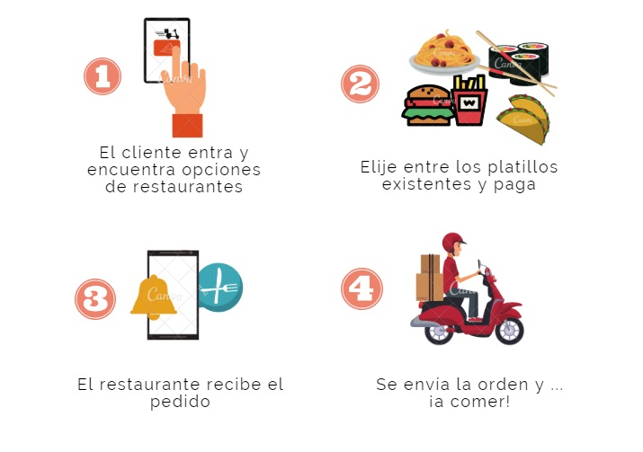
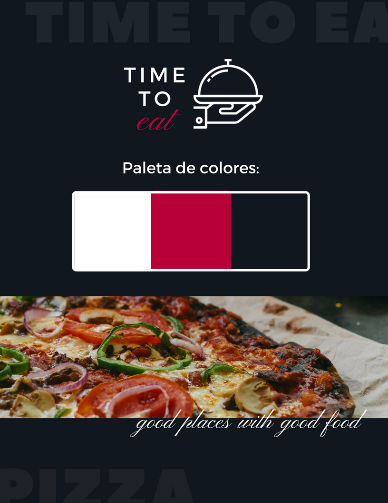

# Time To Eat :fork_and_knife:
### *Encuentra los mejores restaurantes cerca con un solo clic*

Bienvenido a la web-app que te muestra los mejores lugares para comer cerca de ti, T2E es tu opción para encontrar algo delicioso que comer sin importar la hora o el tipo de comida que busques.

# Investigación y estrategia :pencil:

Actualmente el mercado de aplicaciones de comida es sin duda uno de los temas más demandados y repetidos, existen aplicaciónes tanto saludables como de aprendizaje y sociales, cada una con un objetivo específico, es importante tener en cuenta que algunas de las mas exitosas y efectivas son aquellas que permiten a los usuarios buscar fotos, videos y reseñas de una forma directa y dinámica.

## Objetivo del negocio

 - Convertirse en el socio tecnológico de la industria restaurantera en México, ayudando a pequeños locales para que puedan abrir sus servicios de pedidos en línea.

## Historias de usuario

- Historia de usuario **No. 1**: **Como** usuario de T2E **quiero** saber el ranking y reseñas de lugares para comer cerca de mi **para** poder elegir que comer y conocer nuevos lugares.
- Historia de usuario **No.2**: **Como** restaurante afiliado a T2E **quiero** conseguir nuevos clientes **para** aumentar mis pedidos y obtener mejores ganancias.
- Historia de usuario **No.3**: **Como** socio de T2E **quiero** ofrecer la mayor cantidad de restaurantes con servicio de comida a domicilio **para** que mis usuarios aumenten.

### Escenarios y casos de uso

 Definimos los procesos que realizan los usuarios en sus contextos reales, a continuación mostramos un ejemplo:

## Navegación y usabilidad

Definimos todos los flujos funcionales que tendrá nuestra app web tanto del lado del usuario para el registro, como para el administrador con la consulta de los datos:

#### Flujo de usuario para registro:

# Diseño Visual :art:

## Logotipo

El logotipo de *Time To Eat* asemeja un mesero llevando un platillo para dar una sensación de coherencia y fijar en la memoria el propósito de la marca, ademas de denotar sompesa en que el platillo puede ser de cualquier índole.

## Colores

El color azul es el que más predomina en el diseño debido a que según la psicología del color, el azul simboliza armonía, fidelidad, simpatía, paz, serenidad, confianza, comunicación, etc. y precisamente en un proceso de registro que puede llegar a estresar al usuario el propósito es brindarle la mayor comodidad y agrado posibles en el proceso.

## Prototipos de alta fidelidad

### Vistas de registro

## [Prototipo clickable](https://marvelapp.com/9b9ijf7)
